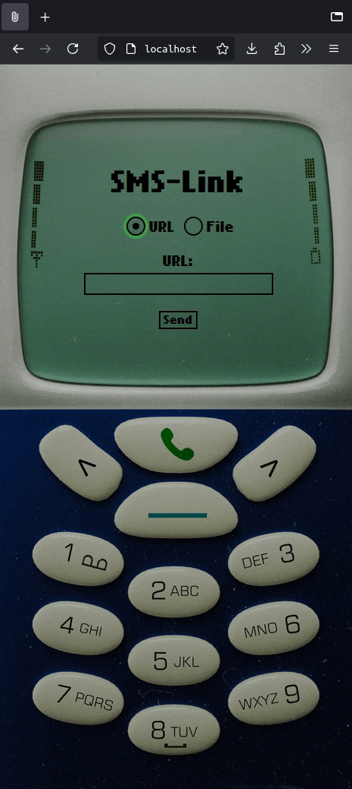

## SMS-Link: A File/URL Texting Helper for Dumbphones

This tool is ideal for phones without cameras or web browsers, or for quickly sending files from your computer via text message. The result is a link or file on your physical phone, which you can forward to someone else.

#### Requirements

1. A Twilio phone number and API credentials (costs a fraction of a cent per text)
2. A computer to build and use this web app
3. A VPS with a web server exposed to the internet (costs ~$5 a month, depending on what provider you choose). Alternatively, this tool could probably be extended to work with a third-party cloud storage API (e.g. Google Drive or Dropbox).

#### Example Use Cases

##### Sending URLs via Text:

1. On your computer, copy and paste a URL into the app
2. Click Send
3. Receive a text, containing the URL, on your cell phone from your Twilio number
4. Copy the URL
5. Open the contact that you'd like to send it to
6. Paste the link and hit send

##### Sending Files via Text:

1. Select a file from your computer
2. Click Send: the file is uploaded to your VPS' web server, generating an accessible link
3. Receive a text, containing the link pointing to that file, on your cell phone from your Twilio number
4. Copy the URL
5. Open the contact that you'd like to send it to
6. Paste the link and hit send

#### Building the App

##### Requirements:

1. Docker
2. Twilio API credentials
3. A VPS with a web server

##### Instructions:

1. `git clone git@github.com:szimonisz/sms-link.git`
2. `mkdir sms-link/docker/keys`
3. `cp ~/.ssh/your-vps-key.pub sms-link/docker/keys`
4. `cp ~/.ssh/your-vps-key sms-link/docker/keys`
5. `cp sms-link/config/config.template.php sms-link/config/config.php`
6. Fill out `config.php` with your cell phone number, Twilio credentials, SSH credentials, and website configuration (for file hosting)
7. `cd docker && docker compose build && docker compose up -d`
8. Visit `localhost`

###### Faceplate Image (Optional):

1. Purchase the faceplate image [here](https://shegiva.gumroad.com/l/iphonewallpaperretro?layout=profile&recommended_by=library)
2. Download the zip file and extract it
3. `cp /path/to/zip/extraction/iPhone\ Plus\ \:\ Pro\ Max/blue.jpg sms-link/public/assets/img/faceplate.jpg`
4. Refresh `localhost`
5. To use a different color, repeat steps 3-4 with a different `{{color}}.jpg`

### Credits

* [Font by Zeh Fernando](https://www.dafont.com/nokia-cellphone.font)
* [Faceplate Image by Shegiva](https://shegiva.gumroad.com/l/iphonewallpaperretro?layout=profile&recommended_by=library)
  * This is a paid asset and is not included in the repository. You can purchase it via the link above.

### TODO:

1. Replace SCP with HTTP POST to the file hosting server's endpoint; avoid SSH key/Docker/apache handling mess
2. Finish writing this README
